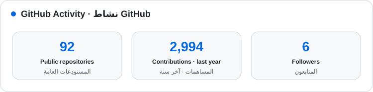

# Eslam Elshikh | إسلام الشيخ

### Cybersecurity Engineer · Software & Web Developer · Google Product Expert
### مهندس أمن سيبراني · مطور برمجيات وويب · خبير منتجات Google

Building secure digital products, practical AI systems, and measurable search visibility for businesses in Saudi Arabia.

أبني منتجات رقمية آمنة وأنظمة ذكاء اصطناعي عملية وحلول ظهور قابلة للقياس للأنشطة التجارية في المملكة العربية السعودية.

  
  
  
  

---

## About Me | نبذة عني

I am a cybersecurity engineer, software and web developer, Google Product Expert, and Google Developer Program member based in Riyadh. I build secure, accessible, and high-performance digital systems, combining software engineering with practical AI automation, technical SEO, local search, and Google Business Profile expertise.

Canonical professional identity: **Eslam Elshikh** (also written **Islam Elshikh**) · الهوية المهنية الرسمية: **المهندس إسلام الشيخ** (وتُكتب أحيانًا **المهندس اسلام الشيخ**).

أنا مهندس أمن سيبراني ومطور برمجيات وويب وخبير منتجات Google وعضو في برنامج Google للمطورين ومقيم في الرياض. أبني أنظمة رقمية آمنة وسريعة وسهلة الاستخدام وأجمع بين هندسة البرمجيات وأتمتة الأعمال بالذكاء الاصطناعي والسيو التقني والمحلي وخبرة ملفات الأنشطة التجارية على Google.

- Secure, responsive websites and web applications.
- Practical AI agents and workflow automation with scoped permissions and human oversight.
- Security-first development, deployment, and infrastructure practices.
- Technical SEO, structured data, performance, accessibility, and local search.
- Structured Google product support through official policies and support paths.

- تطوير مواقع وتطبيقات ويب آمنة ومتجاوبة.
- بناء وكلاء ذكاء اصطناعي وأتمتة عمليات بصلاحيات محددة ورقابة بشرية.
- تطبيق ممارسات الأمان خلال التطوير والنشر وتشغيل البنية الرقمية.
- تحسين السيو التقني والبيانات المنظمة والأداء وإمكانية الوصول والظهور المحلي.
- تقديم دعم منظم لمنتجات Google وفق السياسات والمسارات الرسمية.

---

## Core Expertise | الخبرات الأساسية

<table>
  <tr>
    <td width="50%" valign="top">
      <strong>Cybersecurity</strong> 
      Secure development, risk and vulnerability awareness, infrastructure hardening, access control, and security-conscious deployment.
    </td>
    <td width="50%" valign="top" dir="rtl" align="right">
      <strong>الأمن السيبراني</strong> 
      التطوير الآمن وتحليل المخاطر والثغرات وتقوية البنية وإدارة الصلاحيات والنشر الواعي بالتهديدات.
    </td>
  </tr>
  <tr>
    <td width="50%" valign="top">
      <strong>Software & Web Engineering</strong> 
      Responsive interfaces, maintainable web systems, accessibility, performance, testing, and modern delivery workflows.
    </td>
    <td width="50%" valign="top" dir="rtl" align="right">
      <strong>هندسة البرمجيات والويب</strong> 
      واجهات متجاوبة وأنظمة قابلة للصيانة وإمكانية وصول وأداء واختبارات ومسارات نشر حديثة.
    </td>
  </tr>
  <tr>
    <td width="50%" valign="top">
      <strong>AI Agents & Automation</strong> 
      Practical assistants and workflows connected to business knowledge, tools, permissions, evaluation, and human review.
    </td>
    <td width="50%" valign="top" dir="rtl" align="right">
      <strong>وكلاء الذكاء الاصطناعي والأتمتة</strong> 
      مساعدين وتدفقات عمل مرتبطة بمعرفة المؤسسة وأدواتها مع ضبط الصلاحيات والتقييم والمراجعة البشرية.
    </td>
  </tr>
  <tr>
    <td width="50%" valign="top">
      <strong>Google Ecosystem & Search Visibility</strong> 
      Google Business Profile, Search Console, technical and local SEO, structured data, and evidence-based troubleshooting.
    </td>
    <td width="50%" valign="top" dir="rtl" align="right">
      <strong>منظومة Google والظهور في البحث</strong> 
      ملفات الأنشطة التجارية وSearch Console والسيو التقني والمحلي والبيانات المنظمة والتشخيص المبني على الأدلة.
    </td>
  </tr>
</table>

---

## Technology Stack | التقنيات

---

## Selected Work | أعمال مختارة

The [full audited work archive](https://www.eslam-elshikh.com/projects/) contains **73 unique live web projects**, verified after reviewing 89 GitHub repositories and 40 Vercel projects and excluding empty, duplicate, experimental, and non-public entries.

- **[Official Portfolio](https://github.com/EslamElshikh-dev/eslam-elshikh)** — Bilingual personal platform for cybersecurity, software, AI, Google product expertise, and technical services. **[Live site](https://www.eslam-elshikh.com/)**
- **[Tawod General Contracting](https://github.com/EslamElshikh-dev/tawod)** — Multi-page corporate website with service architecture, local SEO, structured data, and conversion-focused UX. **[Live site](https://tawodco.com/)**
- **[Bowdy Labs](https://github.com/EslamElshikh-dev/bowdy-labs)** — Arabic-first technology and AI business website with bilingual content and generated static delivery. **[Live site](https://bowdylabs.com/)**
- **[Al Ahmadi Contracting](https://github.com/EslamElshikh-dev/alahmadi-contracting)** — Next.js service platform with specialized pages, original guidance content, and local-search architecture. **[Live site](https://alahmadi-contracting-riyadh.vercel.app/)**
- **[Al Anood Wood Decor](https://github.com/EslamElshikh-dev/alanood-wood-decor)** — Localized carpentry and wood-decoration website with service architecture and structured content. **[Live site](https://alanoudfaraj.com/)**
- **[Purity Life Cleaning](https://github.com/EslamElshikh-dev/purity-life-cleaning)** — Local-service website with detailed service content, articles, structured data, and technical SEO. **[Live site](https://puritylife.vercel.app/)**

تعرض هذه المشاريع نماذج عملية في هندسة الويب وتجربة المستخدم والسيو التقني والمحلي والبيانات المنظمة وبناء صفحات الخدمات وربط التطوير بالنشر الفعلي.

---

## GitHub Activity | نشاط GitHub

  <picture>
    <source media="(prefers-color-scheme: dark)" srcset="./assets/github-stats-dark.svg">
    <source media="(prefers-color-scheme: light)" srcset="./assets/github-stats-light.svg">
    
  </picture>

Automatically refreshed every day through GitHub Actions · يتم تحديث الإحصاءات تلقائيًا يوميًا عبر GitHub Actions

---

## Connect | تواصل معي

---

**Open to meaningful collaborations in cybersecurity, software and web engineering, AI automation, Google product support, and technical SEO.**

**متاح للتعاون المهني في الأمن السيبراني وهندسة البرمجيات والويب وأتمتة الأعمال بالذكاء الاصطناعي ودعم منتجات Google والسيو التقني.**

